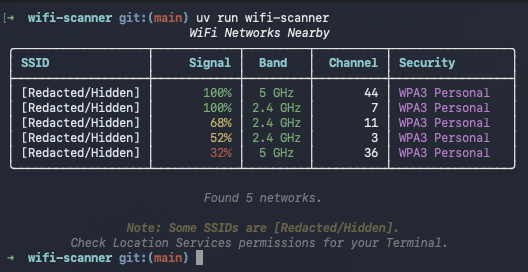
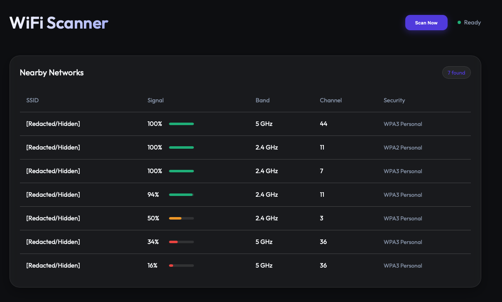

# 🛜 WiFi Scanner

Lightweight WiFi scanner for macOS that displays nearby networks in a beautiful table—both in your terminal and on a web dashboard. Use it for analyzing the least crowded channels in your area.

## Requirements

- macOS (uses `CoreWLAN`)
- Python 3.9+
- `swiftc` (for compiling the scanner utility)

## 📦 Installation

This project is managed with `uv`. To install dependencies and run:

### 💻 Terminal Mode (v1)



```bash
uv sync
# Single scan
uv run wifi-scanner
# Continuous scanning (watch mode)
uv run wifi-scanner --watch
```

### 🌐 Web UI Dashboard (v2)



```bash
uv sync
uv run wifi-scanner --web
```
Then open [http://localhost:8000](http://localhost:8000) in your browser.

## 🪴 Features

- **Multi-Interface**: Access scan results via Terminal or a modern Web UI.
- **Dashboard**: Glassmorphism design with real-time updates and signal strength visualizations.
- **Detailed Info**: Scans for 2.4 GHz, 5 GHz, and 6 GHz networks.
- **Performance**: High-performance Swift-based scanner backend.
- **Color-coded**: Visual signal strength indicators (Terminal & Web).

## 🔒 Permissions

MacOS requires **Location Services** to be enabled for your terminal application to scan for WiFi networks and see SSIDs. 

If SSIDs appear as `[Redacted/Hidden]`:
1. Open **System Settings** > **Privacy & Security** > **Location Services**.
2. Ensure **Location Services** is ON.
3. Ensure your Terminal (e.g., Terminal.app or iTerm2) is allowed to use Location Services.

### Hidden/Redacted SSIDs (sudo note)

MacOS requires elevated privileges for command-line tools to access SSIDs via `CoreWLAN`. If SSIDs appear as `[Redacted/Hidden]`, you must run the scanner with `sudo`.

```bash
sudo swift src/wifi_scanner/scanner.swift
```

However, the application will always show the SSIDs are hidden. 
## 🏴‍☠️ Security & Privacy

This tool:
- Uses `CoreWLAN` to scan for nearby networks.
- Only displays SSID, signal strength, band, channel, and security type.
- **Does not** collect, store, or transmit MAC addresses (BSSIDs) or any other PII.
- The web server runs on `localhost` by default for local-only access.

## ☺️ AI Assistance
This project was created with significant AI assistance using Gemini 3.0 Flash model. 